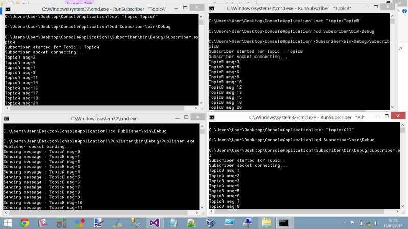

Pub/Pub
=====

NetMQ comes with support for Pub/Sub by way of 2 sockets

+ `PublisherSocket`
+ `SubscriberSocket`

Which as usual can be created by using the `NetMQContext` methods `.CreateXXXSocket()` methods. Which in this case would be

+ `CreatePublisherSocket()`
+ `CreateSubscriberSocket()`

## Topics

NetMQ allows the use of topics, such that the `PublisherSocket` may send frame 1 (see the [messages documentation page](https://github.com/zeromq/netmq/blob/master/docs/message.md)) of the message which contains
the topic name followed by the actual message, where you may have something like this

<table CellSpacing="0" Padding="0">
<tr bgcolor="LightGray">
<th width="100px" style="text-align:center; ">Frame 1</th>
<th width="400px" style="text-align:center; ">Frame 2</th>
</tr>
<tr>
<td width="80px" style="text-align:center; ">TopicA</td>
<td width="400px" style="text-align:center;">This is a 'TopicA' message</td>
</tr>
</table>

An example of this in code may be something like this (though you could also use the `NetMQMessage` approach where you add the frames one by one):

    :::csharp
    pubSocket.SendMore("TopicA").Send("This is a 'TopicA' message");

The `SubscriberSocket` may also choose to subscribe to a certain topic only, which it does by passing the topic name into the `Subscribe()` method of the `SubscriberSocket`.

An example of this would be as follows:

    :::csharp
    subSocket.Subscribe("TopicA");

## How Do You Subscribe To ALL Topics?

It is also possibe for a subscriber to subscribe to all topics from a publishing socket, which means it will recieve (that is providing no messages are dropped see 'Further Considerations'section below)
ALL the messages from the `PublisherSocket` the `SubscriberSocket` is connected to. This is easily achieved, all you need to do in the subscriber is to pass an empty string ("") in for the topic name when
calling the `subscriberSocket.Subscribe()` method.

## An Example

Time for an example. This example is very simple, and follows these rules.

+ There is 1 Publisher, who is creating messages, that could be for "TopicA" or "TopicB" (depending on the result of the random number produced)
+ There is a generic Subscriber (the topic name is fed in via the command line arguments) that will subscribe to the incoming topic name

Here is the code:

### Publisher

    :::csharp
    using System;
    using System.Threading;
    using NetMQ;

    namespace Publisher
    {
        class Program
        {
            static void Main(string[] args)
            {
                Random rand = new Random(50);

                using (var context = NetMQContext.Create())
                {
                    using (var pubSocket = context.CreatePublisherSocket())
                    {
                        Console.WriteLine("Publisher socket binding...");
                        pubSocket.Options.SendHighWatermark = 1000;
                        pubSocket.Bind("tcp://localhost:12345");

                        for (var i = 0; i < 100; i++)
                        {
                            var randomizedTopic = rand.NextDouble();
                            if (randomizedTopic > 0.5)
                            {
                                var msg = "TopicA msg-" + i;
                                Console.WriteLine("Sending message : {0}", msg);
                                pubSocket.SendMore("TopicA").Send(msg);
                            }
                            else
                            {
                                var msg = "TopicB msg-" + i;
                                Console.WriteLine("Sending message : {0}", msg);
                                pubSocket.SendMore("TopicB").Send(msg);
                            }

                            Thread.Sleep(500);
                        }
                    }
                }
            }
        }
    }

### Subscriber

    :::csharp
    using System;
    using System.Collections.Generic;
    using System.Diagnostics;
    using System.Linq;
    using System.Text;
    using System.Threading.Tasks;
    using NetMQ;

    namespace SubscriberA
    {
        class Program
        {

            public static List<string> allowableCommandLineArgs = new List<string>();

            static Program()
            {
                allowableCommandLineArgs.Add("TopicA");
                allowableCommandLineArgs.Add("TopicB");
                allowableCommandLineArgs.Add("All");
            }

            static void PrintUsageAndExit()
            {
                Console.WriteLine("Subscriber is expected to be started with either 'TopicA', 'TopicB' or 'All'");
                Console.ReadLine();
                Environment.Exit(-1);
            }

            static void Main(string[] args)
            {

                if (args.Length != 1)
                {
                    PrintUsageAndExit();
                }

                if (!allowableCommandLineArgs.Contains(args[0]))
                {
                    PrintUsageAndExit();
                }

                string topic = args[0] == "All" ? "" : args[0];
                Console.WriteLine("Subscriber started for Topic : {0}", topic);

                using (var context = NetMQContext.Create())
                {
                    using (var subSocket = context.CreateSubscriberSocket())
                    {
                        subSocket.Options.ReceiveHighWatermark = 1000;
                        subSocket.Connect("tcp://localhost:12345");
                        subSocket.Subscribe(topic);
                        Console.WriteLine("Subscriber socket connecting...");
                        while (true)
                        {
                            string messageTopicReceived = subSocket.ReceiveString();
                            string messageReceived = subSocket.ReceiveString();
                            Console.WriteLine(messageReceived);
                        }
                    }
                }
            }
        }
    }

To run this, these 3 BAT file you may be useful, though you will need to change them to suit your code location should you choose to copy this example code into a new set of projects

### RunPubSub.bat

    :::text
    start RunPublisher.bat
    start RunSubscriber "TopicA"
    start RunSubscriber "TopicB"
    start RunSubscriber "All"

### RunPublisher.bat

    :::text
    cd Publisher\bin\Debug
    Publisher.exe

### RunSubscriber.bat

    ::text
    set "topic=%~1"
    cd Subscriber\bin\Debug
    Subscriber.exe %topic%

When run, you should see something like this:

Other Considerations
=====

### High water mark

The `SendHighWaterMark`/`ReceiveHighWaterMark` options set the high water mark for the specified socket. The high water mark is a hard limit on the maximum number of outstanding messages NetMQ shall queue in memory for any single peer that the specified socket is communicating with.

If this limit has been reached the socket shall enter an exceptional state and depending on the socket type, NetMQ shall take appropriate action such as blocking or dropping sent messages.

The default `SendHighWaterMark`/`ReceiveHighWaterMark` value of zero means "no limit".

You would set these 2 options using the `xxxxSocket.Options` property as follows:

+  `pubSocket.Options.SendHighWatermark = 1000;`
+  `pubSocket.Options.ReceiveHighWatermark = 1000;`

### Slow subscribers

This is covered in the <a href="http://zguide.zeromq.org/php:chapter5" target="_blank">ZeroMQ guide</a>

### Late joining subscribers

This is covered in the <a href="http://zguide.zeromq.org/php:chapter5" target="_blank">ZeroMQ guide</a>
